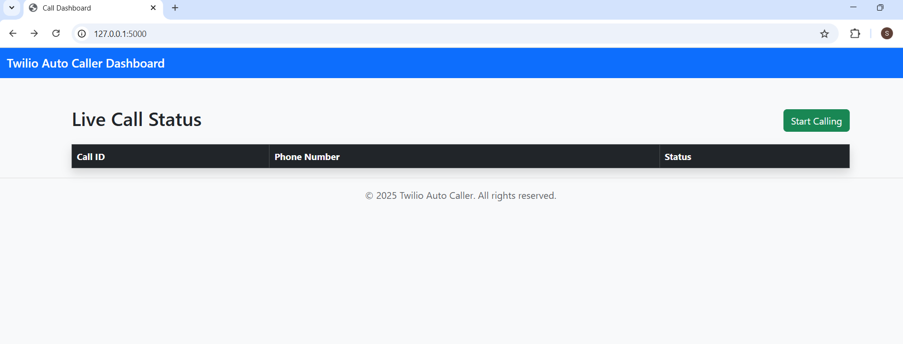

# 📞 Twilio Auto Caller Web App

A Python Flask application to dial multiple numbers in parallel using Twilio, display real-time call status in a Bootstrap dashboard, log results in SQLite, and support IVR interaction.

---

## 🚀 Features

✅ Dial multiple numbers from a CSV  
✅ Track real-time call status via a Flask UI  
✅ Press-1 IVR to route to a live agent  
✅ Log calls in SQLite  
✅ Scheduler for automatic calling  

---

## 🖥️ UI Preview




## 🧰 Tech Stack

- Python 3.10+
- Flask 2+
- Twilio Voice API
- Bootstrap 5
- SQLite3
- Schedule (for job automation)

---

## 🛠 Setup Instructions

1. **Clone the repo**  
```bash
git clone https://github.com/yourname/twilio-flask-auto-caller.git
cd twilio-flask-auto-caller

2.Install dependencies

pip install -r requirements.txt


3. Setup environment variables

Create a .env file:

TWILIO_ACCOUNT_SID=your_sid
TWILIO_AUTH_TOKEN=your_token
TWILIO_PHONE_NUMBER=+1234567890
AGENT_NUMBER=+19876543210


4. Add phone numbers to numbers.csv

+12345678901
+12345678902


5. Start the app

python app.py


6. (Optional) Run scheduler

python scheduler.py


🌐 Deployment Notes

Use ngrok for Twilio webhook testing:

ngrok http 5000

Set WEBHOOK_URL to the public URL from ngrok in your .env.


📄 License
MIT License – feel free to modify and share.


---

Would you like a downloadable ZIP with everything included, or instructions to deploy on a cloud platform (e.g. Render or Heroku)?


